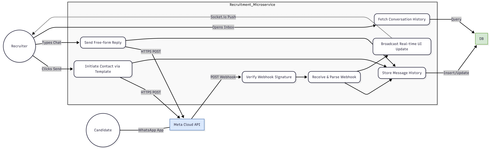

# WhatsApp Recruitment System - Use Case Diagram

## Visual Diagram



## System Components

### **Actors**

- **Recruiter**: HR staff initiating candidate outreach and managing conversations
- **Candidate**: Job applicants receiving and replying to WhatsApp messages
- **Meta Cloud API**: WhatsApp Business Cloud API for message delivery
- **MongoDB**: Database storing conversation history and message metadata

### **Core Use Cases**

#### **UC1: Initiate Contact via Template**
- **Actor**: Recruiter
- **Description**: Send first message using Meta-approved utility template
- **Key Technology**: HTTPS POST to Meta Cloud API
- **Cost**: ~0.13 MAD per template message
- **Database Impact**: INSERT new conversation + message record

#### **UC2: Send Free-form Reply**
- **Actor**: Recruiter
- **Description**: Send conversational message within 24-hour window
- **Key Technology**: HTTPS POST to Meta Cloud API
- **Cost**: FREE (within customer service window)
- **Database Impact**: INSERT message record

#### **UC3: Receive & Parse Webhook**
- **Actor**: Meta Cloud API
- **Description**: Process incoming candidate replies
- **Key Technology**: Express.js webhook endpoint `/webhook/whatsapp`
- **Security**: Must verify HMAC-SHA256 signature
- **Database Impact**: Triggers message storage

#### **UC4: Store Message History**
- **Actor**: System
- **Description**: Persist all messages (inbound/outbound) to MongoDB
- **Collections**: `conversations`, `messages`
- **Indexes**: candidatePhone, timestamp, status
- **Retention**: Indefinite (subject to GDPR deletion requests)

#### **UC5: Broadcast Real-time UI Update**
- **Actor**: System
- **Description**: Push message updates to recruiter UI via WebSocket
- **Key Technology**: Socket.io v4.x
- **Events**: `message:received`, `message:sent`, `message:delivered`, `message:read`
- **Latency**: < 100ms from webhook receipt

#### **UC6: Fetch Conversation History**
- **Actor**: Recruiter
- **Description**: Retrieve past messages with candidate
- **API Endpoint**: `GET /api/conversations/:candidateId`
- **Response**: Paginated message list (50 per page)
- **Database**: Query MongoDB `messages` collection

#### **UC7: Verify Webhook Signature**
- **Actor**: System (Security Layer)
- **Description**: Validate webhook authenticity using Meta app secret
- **Algorithm**: HMAC-SHA256
- **Headers**: `X-Hub-Signature-256`
- **Failure**: Reject webhook with 401 Unauthorized

---

## Key Technologies

| Component | Technology | Purpose |
|-----------|-----------|---------|
| **Meta Cloud API** | WhatsApp Business Cloud API | Message delivery (0.13 MAD/msg) |
| **Database** | MongoDB Atlas | Conversation & message storage |
| **Real-time** | Socket.io v4.x | Live UI updates to recruiters |
| **Backend** | Node.js v20 LTS + Express v4.x | REST API + webhook server |
| **Security** | HMAC-SHA256 | Webhook signature verification |
| **Deployment** | ngrok (dev) → Azure/AWS (prod) | Public webhook endpoint |

---

## Message Flow

### **Outbound Flow (Recruiter → Candidate)**
1. Recruiter clicks "Send" in UI
2. Frontend calls `POST /api/whatsapp/send-template`
3. Backend validates template and candidate consent
4. HTTPS POST to Meta Cloud API
5. Store message in MongoDB with `status: 'sent'`
6. WebSocket broadcasts `message:sent` to UI
7. Meta sends webhook when delivered → Update status to `delivered`
8. Meta sends webhook when read → Update status to `read`

### **Inbound Flow (Candidate → Recruiter)**
1. Candidate replies via WhatsApp app
2. Meta Cloud API calls `POST /webhook/whatsapp`
3. System verifies webhook signature (UC7)
4. Parse message payload (UC3)
5. Store in MongoDB (UC4)
6. Broadcast to recruiter UI via WebSocket (UC5)
7. Recruiter sees notification in < 100ms

---

## Database Schema

### **conversations** Collection
```javascript
{
  _id: ObjectId,
  candidateId: String,           // Candidate reference ID
  candidatePhone: String,         // +212XXXXXXXXX format
  recruiterId: String,
  jobPosition: String,
  conversationStatus: String,     // 'active' | 'closed' | 'archived'
  lastMessageAt: Date,
  hasConsent: Boolean,            // GDPR compliance flag
  createdAt: Date,
  updatedAt: Date
}
```

### **messages** Collection
```javascript
{
  _id: ObjectId,
  conversationId: ObjectId,
  messageId: String,              // WhatsApp message ID (wamid.XXX)
  direction: String,              // 'outbound' | 'inbound'
  from: String,                   // 'recruiter' | 'candidate'
  content: String,
  messageType: String,            // 'template' | 'text' | 'image'
  templateName: String,           // if type = 'template'
  status: String,                 // 'sent' | 'delivered' | 'read' | 'failed'
  statusUpdatedAt: Date,
  timestamp: Date,
  metadata: Object
}
```

---

## API Endpoints

| Method | Endpoint | Description | Auth |
|--------|----------|-------------|------|
| POST | `/api/whatsapp/send-template` | Send initial template message | Bearer Token |
| POST | `/api/whatsapp/send-message` | Send free-form message (24h window) | Bearer Token |
| POST | `/webhook/whatsapp` | Receive Meta webhooks | Signature Verification |
| GET | `/webhook/whatsapp` | Webhook verification challenge | Public |
| GET | `/api/conversations/:candidateId` | Get conversation history | Bearer Token |
| GET | `/api/conversations` | List all conversations | Bearer Token |

---

## Cost Analysis

| Message Type | Cost per Message | Use Case |
|--------------|------------------|----------|
| **Utility Template** | 0.13 MAD ($0.0126 USD) | First contact with candidate |
| **Free-form Reply** | FREE | Follow-up within 24 hours |
| **Service Message** | FREE | Candidate replies (always free) |

**Example Costs:**
- 50 candidates: 50 × 0.13 MAD = **6.50 MAD**
- 500 candidates: 500 × 0.13 MAD = **65 MAD**
- 2,000 candidates: 2,000 × 0.13 MAD = **260 MAD**

**Compared to SMS (D7 Networks: 0.29 MAD/SMS):**
- WhatsApp is **55% cheaper**
- FREE replies within 24h (SMS charges both ways)

---

## Security & Compliance

### **Webhook Signature Verification**
```javascript
const crypto = require('crypto');

function verifyWebhookSignature(payload, signature, appSecret) {
  const expectedSignature = crypto
    .createHmac('sha256', appSecret)
    .update(payload)
    .digest('hex');
  
  return `sha256=${expectedSignature}` === signature;
}
```

### **GDPR Compliance**
- `hasConsent` flag in conversations collection
- Opt-out handling via `STOP` keyword
- Right to deletion: `DELETE /api/conversations/:id`
- Data retention: Configurable (default: indefinite)

---

## Development Phases

### **Phase 1: Core Messaging** (Week 1-2)
- ✅ UC1: Send template message
- ✅ UC3: Receive webhook
- ✅ UC4: Store in MongoDB
- ✅ UC7: Verify signature
- ✅ Basic UI to send/receive

### **Phase 2: Real-Time Updates** (Week 2-3)
- ✅ UC5: WebSocket integration
- ✅ Message status tracking (delivered/read)
- ✅ Notification system

### **Phase 3: Full Features** (Week 3-4)
- ✅ UC6: Conversation history
- ✅ UC2: Free-form replies
- ✅ Search functionality
- ✅ Analytics dashboard

### **Phase 4: Production** (Week 4+)
- ✅ GDPR deletion
- ✅ Error handling & retry logic
- ✅ Deployment to Azure/AWS
- ✅ Monitoring & alerting

| Use Case | Description | Actor | Database Impact |
|----------|-------------|-------|----------------|
| **Send Template Message** | Send first message using approved template | Recruiter → WhatsApp API | INSERT conversation + message |
| **Receive Message** | Process incoming message from candidate | WhatsApp API → System | INSERT message |
| **Store Conversation** | Save all messages to MongoDB | System | INSERT/UPDATE documents |
| **Receive Webhook** | Accept and verify webhooks from Meta | WhatsApp API → System | Triggers message processing |
| **Track Message Status** | Update delivery/read status | WhatsApp API → System | UPDATE message status |
| **Broadcast via WebSocket** | Send real-time updates to UI | System → Recruiter | READ from DB |
| **Retrieve History** | Get conversation history for candidate | Recruiter → System | READ conversations |

### Priority 2: Important (Post-MVP)

| Use Case | Description | Actor | Database Impact |
|----------|-------------|-------|----------------|
| **Send Free-Form Message** | Send message during 24h window | Recruiter → WhatsApp API | INSERT message |
| **Notify Recruiter** | Alert recruiter of new reply | System → Recruiter | READ + WebSocket emit |
| **Search Conversations** | Find conversations by keyword/candidate | Recruiter → System | READ with text search |
| **Update Message Status** | Mark as delivered/read/failed | System | UPDATE message status |
| **Check Consent** | Verify candidate gave WhatsApp consent | System | READ candidate consent |
| **Parse Message** | Extract message content from webhook | System | N/A (in-memory) |

### Priority 3: Nice-to-Have (Future)

| Use Case | Description | Actor | Database Impact |
|----------|-------------|-------|----------------|
| **Create Template** | Define new message template | Recruiter → System | INSERT template |
| **Handle Opt-Out** | Process candidate stop request | Candidate → System | UPDATE conversation closed |
| **Delete Data (GDPR)** | Remove all candidate data | System | DELETE candidate data |
| **Generate Cost Report** | Calculate WhatsApp API costs | System → Recruiter | READ + aggregate messages |
| **Track Delivery Rate** | Monitor message delivery success | System | READ + calculate metrics |
| **Archive Old Conversations** | Move old conversations to archive | System (scheduled) | UPDATE archived flag |

---

## MongoDB Collections Needed

Based on the use cases above:

```javascript
// 1. conversations collection
{
  _id: ObjectId,
  candidateId: String,
  candidatePhone: String,
  recruiterId: String,
  jobPosition: String,
  conversationStatus: String, // 'active' | 'closed' | 'archived'
  lastMessageAt: Date,
  hasConsent: Boolean,
  createdAt: Date,
  updatedAt: Date
}

// 2. messages collection
{
  _id: ObjectId,
  conversationId: ObjectId,
  messageId: String, // WhatsApp message ID
  direction: String, // 'outbound' | 'inbound'
  from: String, // 'recruiter' | 'candidate'
  content: String,
  messageType: String, // 'template' | 'text' | 'image' | 'document'
  templateName: String, // if type = 'template'
  status: String, // 'sent' | 'delivered' | 'read' | 'failed'
  statusUpdatedAt: Date,
  timestamp: Date,
  metadata: Object // any additional data
}

// 3. templates collection (optional)
{
  _id: ObjectId,
  name: String,
  category: String, // 'utility' | 'marketing' | 'authentication'
  language: String,
  status: String, // 'draft' | 'pending' | 'approved' | 'rejected'
  content: String,
  variables: Array,
  createdBy: String,
  createdAt: Date
}

// 4. webhooks_log collection (for debugging)
{
  _id: ObjectId,
  webhookType: String,
  payload: Object,
  signature: String,
  verified: Boolean,
  processed: Boolean,
  error: String,
  timestamp: Date
}
```

---

## API Endpoints Required

### Messaging Endpoints
- `POST /api/whatsapp/send-template` - Send template message
- `POST /api/whatsapp/send-message` - Send free-form message
- `POST /webhook/whatsapp` - Receive Meta webhooks
- `GET /webhook/whatsapp` - Webhook verification

### Conversation Endpoints
- `GET /api/conversations/:candidateId` - Get conversation history
- `GET /api/conversations` - List all conversations (with pagination)
- `POST /api/conversations/search` - Search conversations
- `PATCH /api/conversations/:id/close` - Close conversation
- `DELETE /api/conversations/:id` - Delete conversation (GDPR)

### Message Endpoints
- `GET /api/messages/:conversationId` - Get messages for conversation
- `PATCH /api/messages/:id/status` - Update message status

### Template Endpoints
- `GET /api/templates` - List available templates
- `POST /api/templates` - Create new template
- `GET /api/templates/:id` - Get template details

### Analytics Endpoints
- `GET /api/analytics/delivery-rate` - Get delivery rate stats
- `GET /api/analytics/response-time` - Get response time metrics
- `GET /api/analytics/costs` - Get cost breakdown

---

## WebSocket Events

### Client → Server
- `subscribe:conversation` - Subscribe to conversation updates
- `mark:read` - Mark messages as read

### Server → Client
- `message:received` - New message from candidate
- `message:sent` - Message sent successfully
- `message:delivered` - Message delivered to candidate
- `message:read` - Candidate read the message
- `message:failed` - Message failed to send
- `conversation:updated` - Conversation metadata changed

---

## Development Phases

### Phase 1: Core Messaging (Week 1-2)
- ✅ Send template message
- ✅ Receive webhook
- ✅ Parse incoming message
- ✅ Store in MongoDB
- ✅ Basic UI to send/receive

### Phase 2: Real-Time Updates (Week 2-3)
- ✅ WebSocket integration
- ✅ Broadcast message updates
- ✅ Notify recruiter of replies
- ✅ Message status tracking

### Phase 3: Full Features (Week 3-4)
- ✅ Conversation history
- ✅ Search functionality
- ✅ Template management
- ✅ Analytics dashboard

### Phase 4: Compliance & Production (Week 4+)
- ✅ Consent tracking
- ✅ Opt-out handling
- ✅ GDPR deletion
- ✅ Error handling & logging
- ✅ Production deployment
